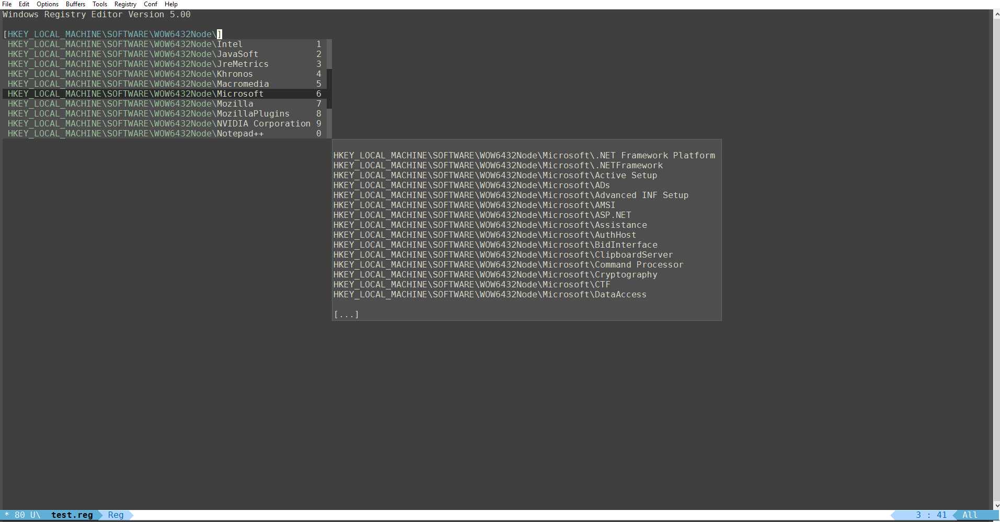

# company-w32reg - Company-backend for windows registry files

*Author:* Noah Peart <noah.v.peart@gmail.com> 

 Company-mode backend for editing windows registry files (.reg).
 Provides company completion for keys between '[]'.

## Usage

Add to a suitable location on the `load-path` and either require or autoload
`company-w32reg`.  Then add to company-backends where desired.

See: [w32-registry-mode](http://github.com/nverno/w32-registry-mode)
for a major mode for registry files. 

## Example

## Todo

* Add better support for data types/values.
* Fix expansions of root abbreviations

---
Converted from `company-w32reg.el` by [*el2markdown*](https://github.com/Lindydancer/el2markdown).
